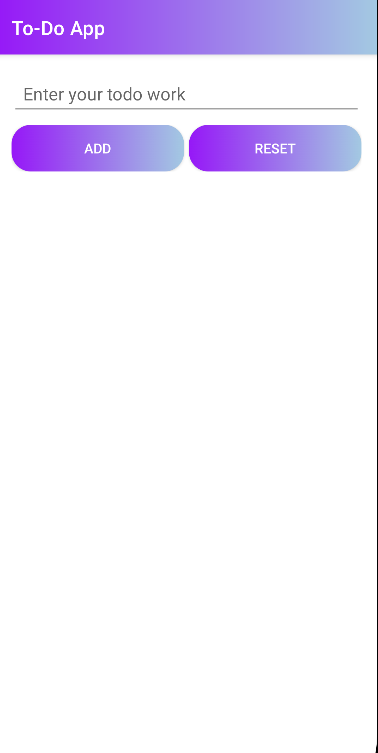
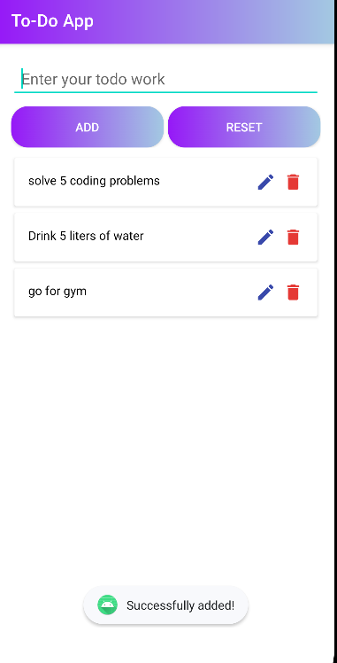
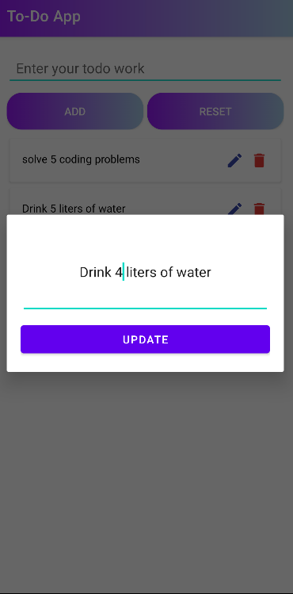
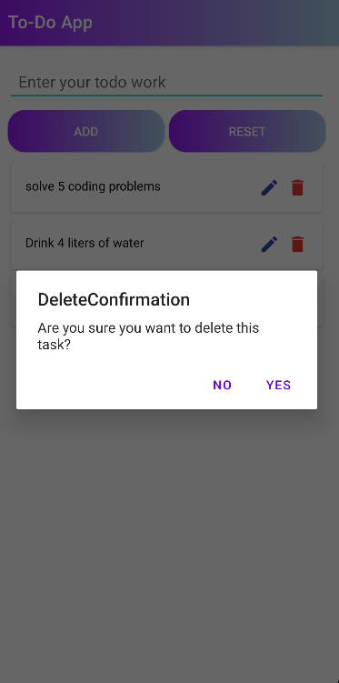

# ToDo App

An Android Java ToDo App to help you manage your tasks and stay organized.

## Screenshots

<table>
  <tr>
    <td></td>
    <td></td>
  </tr>
  <tr>
    <td></td>
    <td></td>
  </tr>
</table>

## Technologies/Libraries Used

- Java
- Android Studio
- XML for layout design

## Features

- Add, edit, and delete tasks.
- Mark tasks as completed.
- User-friendly interface.

## Installation

1. Clone the repository: `git clone https://github.com/DhavalChhaylaOfficial/ToDoApp.git`
2. Open the project in Android Studio.
3. Build and run the app on an emulator or physical device.

## Contributing Guidelines

- Report any issues using the GitHub issue tracker.
- Feel free to fork the repository and submit pull requests for new features or bug fixes.

## License

This project is licensed under the MIT License - see the [LICENSE.md](LICENSE.md) file for details.

## Contact

For questions or feedback, contact Dhaval Chhayla at dhavalhchhayla@gmail.com.
